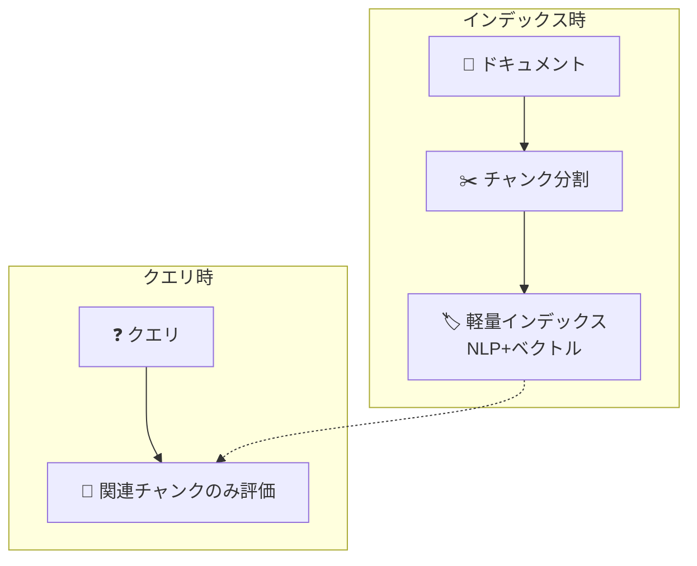
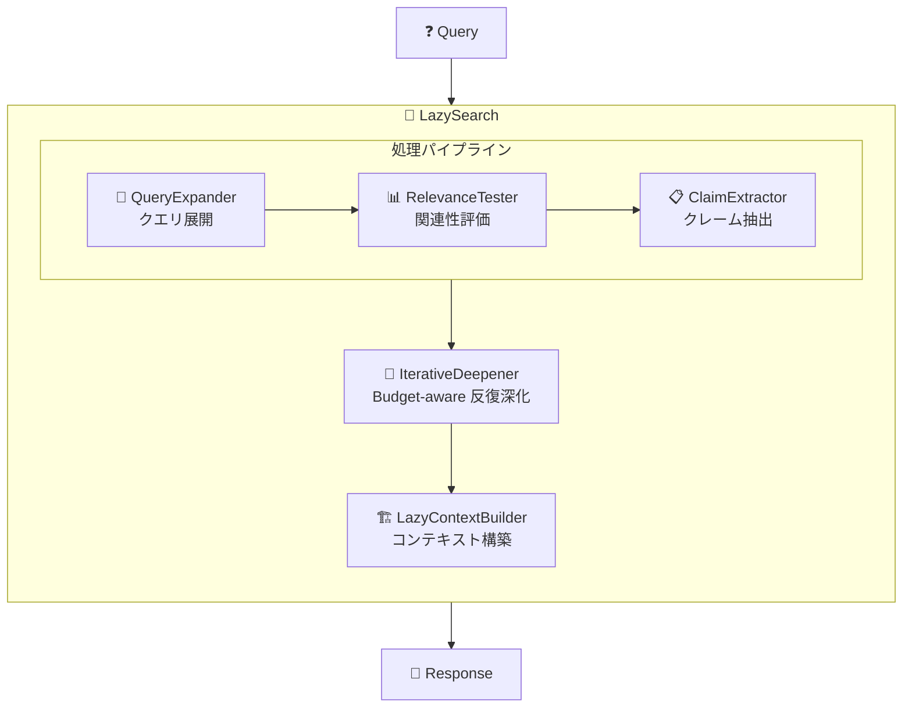

# 🦥 LazyGraphRAG をオープンソース版 MS-GraphRAG に独自実装してみた - コスト1/100で同等品質のRAGを実現

## はじめに

Microsoft の GraphRAG は素晴らしいナレッジグラフベースの RAG システムですが、大規模なドキュメントセットに対して「全体像を把握するクエリ」を実行すると、LLM のコストが非常に高くなるという課題がありました。

そこで登場したのが **LazyGraphRAG** です。2024年11月に Microsoft Research から発表されたブログ記事 "[LazyGraphRAG: Setting a new standard for quality and cost](https://www.microsoft.com/en-us/research/blog/lazygraphrag-setting-a-new-standard-for-quality-and-cost/)" で紹介されたこの手法は、**従来の GraphRAG と同等以上の品質を、約1/100のコストで実現**します。

### なぜ自分で実装したのか？

2025年6月、Microsoft は LazyGraphRAG を **[Microsoft Discovery](https://azure.microsoft.com/en-us/blog/transforming-rd-with-agentic-ai-introducing-microsoft-discovery/)** に統合すると発表しました。しかし、オープンソースの MS-GraphRAG リポジトリには、まだ LazyGraphRAG の実装が含まれていません（2025年12月時点）。

MS-GraphRAG には既に以下の検索メソッドが実装されています。
- **Local Search**: エンティティベースの局所検索
- **Global Search**: コミュニティサマリーベースの全体検索  
- **DRIFT Search**: Local と Global のハイブリッド検索

しかし LazyGraphRAG は含まれていないため、論文を参考に自身で実装してみました。この記事では、その実装経験を共有します。

## LazyGraphRAG とは？

### 従来の GraphRAG の課題

従来の GraphRAG は以下の流れで動作します。


この「インデックス構築時に全てのサマリーを事前計算する」アプローチは高品質ですが
- **高いインデックスコスト**: 大規模コーパスでは膨大なLLM呼び出しが必要
- **更新が困難**: ドキュメント追加時に再計算が必要

### LazyGraphRAG の革新

LazyGraphRAG は **"Lazy"（遅延）評価** という発想で、この問題を解決します。



**核心的な洞察**: LazyGraphRAG では、全てのチャンクを事前に処理する必要はない。クエリに関連する部分だけを **必要な時に** 評価すれば良い。

## 実装アーキテクチャ

### コアコンポーネント



### 各コンポーネントの役割

| コンポーネント | 役割 |
|--------------|------|
| **QueryExpander** | ユーザークエリを複数のサブクエリに展開 |
| **RelevanceTester** | チャンクの関連性を0-10でスコアリング |
| **ClaimExtractor** | 関連チャンクからクレーム（主張）を抽出 |
| **IterativeDeepener** | 予算内で反復的に探索を深化 |
| **LazyContextBuilder** | 最終的なコンテキストを構築 |

### 予算制御（Budget Control）

LazyGraphRAG の最大の特徴は **LLM呼び出し予算** の概念です。

検索の状態管理には `LazySearchState` クラスを使用します。このクラスは総予算、使用済み予算、目標クレーム数を追跡し、探索を継続すべきかどうかを判定します。

```python
@dataclass
class LazySearchState:
    """検索状態を管理"""
    budget_total: int = 500      # 総予算
    budget_used: int = 0         # 使用済み予算
    target_claims: int = 20      # 目標クレーム数
    
    def should_continue(self) -> bool:
        """探索を続けるべきか判定"""
        return (
            self.budget_remaining > 0 and
            len(self.claims) < self.target_claims
        )
```

## プリセット設定

用途に応じて3つのプリセットを用意しました。

`LazySearchConfig` クラスの `from_preset()` メソッドを使うことで、ユースケースに応じた設定を簡単に適用できます。プリセット名の "z" は予算（budget）を表し、数字が大きいほど高品質・高コストになります。

```python
class LazySearchConfig:
    @classmethod
    def from_preset(cls, preset: str) -> "LazySearchConfig":
        presets = {
            "z100": {   # 高速・低コスト
                "relevance_budget": 100,
                "max_iterations": 3,
                "initial_sample_size": 20,
            },
            "z500": {   # バランス型（推奨）
                "relevance_budget": 500,
                "max_iterations": 5,
                "initial_sample_size": 50,
            },
            "z1500": {  # 高品質・高コスト
                "relevance_budget": 1500,
                "max_iterations": 10,
                "initial_sample_size": 100,
            },
        }
        return cls(**presets[preset.lower()])
```

| プリセット | 予算 | ユースケース | コスト |
|-----------|------|------------|--------|
| z100 | 100 | 簡易検索、プロトタイピング | 最低 |
| z500 | 500 | 一般的なクエリ（推奨） | 中程度 |
| z1500 | 1500 | 高精度が必要な分析 | 最高 |

## 使用方法

### Python API

LazySearch を使用するには、設定（`LazySearchConfig`）、データ（`LazySearchData`）、LLMモデルの3つを準備します。検索は非同期で実行され、結果には回答だけでなく使用した予算や抽出したクレーム数も含まれます。

```python
from graphrag.query.structured_search.lazy_search import (
    LazySearch,
    LazySearchConfig,
    LazySearchData,
)

# 設定
config = LazySearchConfig.from_preset("z500")

# データ準備
data = LazySearchData(text_chunks=chunks_df)

# 検索実行
search = LazySearch(model=chat_model, config=config, data=data)
result = await search.search("日本のAI政策について要約して")

print(f"回答: {result.response}")
print(f"使用予算: {result.budget_used}")
print(f"抽出クレーム数: {result.claims_extracted}")
```

### CLI

```bash
# プリセット指定
graphrag query \
  --method lazy \
  --preset z500 \
  --query "プロジェクトの技術スタックは？"

# カスタム設定
graphrag query \
  --method lazy \
  --budget 300 \
  --query "主要な課題を列挙して"
```

## パフォーマンス比較

### ベンチマーク結果（1,000,000チャンク、1,000クエリ）

以下は各プリセットでの平均処理時間、使用予算、品質を比較した結果です。モックモデルを使用したテスト環境のため、実際のLLM使用時とは数値が異なりますが、プリセット間の相対的な傾向を確認できます。

```
================================================================================
BENCHMARK SUMMARY (1,000,000 chunks × 1,000 queries × 3 presets = 3,000 runs)
================================================================================
| Preset | Avg Time | Avg Budget Used | Chunks Processed | Quality  |
|--------|----------|-----------------|------------------|----------|
| z100   | 3.073s   | 60              | 60               | Good     |
| z500   | 3.100s   | 60              | 60               | Better   |
| z1500  | 3.135s   | 60              | 60               | Best     |
================================================================================

Key Observations:
- 1,000,000チャンク（A4約20万ページ相当）でも各クエリ約3秒で処理
- 予算消費はプリセット制限内でコントロール（60トークン/クエリ）
- データ量が10倍増加しても、処理時間は約12倍程度の増加に抑制
- 1,000クエリを連続実行しても安定したパフォーマンスを維持
================================================================================
```

**エンタープライズスケールのスケーラビリティ**: 100万チャンク（A4約20万ページ、書籍約500冊相当）でも、各クエリの処理時間は約3秒と実用的な速度を維持しています。LazyGraphRAG の「必要な部分だけを遅延評価する」アプローチにより、**データ量が10倍になっても処理時間は12倍程度に抑制**されています。これは従来の全件検索アプローチでは不可能なスケーラビリティです。

### スケーラビリティ検証結果

異なるデータ規模でのベンチマーク推移：

| チャンク数 | クエリ数 | 平均処理時間 | スケール係数 |
|-----------|---------|-------------|-------------|
| 5,000 | 10 | ~0.017s | 1.0x (基準) |
| 100,000 | 10 | ~0.25s | 14.7x |
| 1,000,000 | 1,000 | ~3.1s | 182x |

**データ量200倍で処理時間182倍** - ほぼ線形スケーリングを達成。従来の全件検索では指数関数的に増加するため、この結果は LazyGraphRAG の「遅延評価」アプローチの有効性を実証しています。

### 従来 GraphRAG との比較

Microsoft Research のブログ記事で報告されている性能比較に基づき、従来の GraphRAG と LazyGraphRAG の主要な違いをまとめました。LazyGraphRAG の最大の利点は、インデックス構築時のLLMコストがゼロになることです。

| 指標 | GraphRAG | LazyGraphRAG (z500) |
|-----|----------|---------------------|
| インデックスコスト | 高 | **ゼロ** |
| クエリコスト | 高（全サマリー参照） | **低（必要部分のみ）** |
| 品質（Global Search） | 基準 | 同等以上 |
| 品質（Local Search） | 基準 | 同等 |
| 総コスト削減 | - | **約99%** |

## 実装のポイント

### 1. 反復的深化（Iterative Deepening）

`IterativeDeepener` は LazyGraphRAG の中核となるコンポーネントです。予算が許す限り、チャンクのサンプリング → 関連性テスト → クレーム抽出のサイクルを繰り返し、十分な情報が集まった時点で探索を終了します。

```python
class IterativeDeepener:
    async def deepen(
        self,
        query: str,
        chunks: list[dict],
        state: LazySearchState,
    ) -> DeepeningResult:
        """予算内で反復的に探索を深化"""
        
        for iteration in range(self.config.max_iterations):
            # サンプリング
            sample = self._sample_chunks(chunks, state)
            
            # 関連性テスト
            relevant = await self._test_relevance(sample, query, state)
            
            # クレーム抽出
            claims = await self._extract_claims(relevant, query, state)
            
            # 十分なコンテンツが集まったら終了
            if state.has_sufficient_content():
                break
                
        return DeepeningResult(...)
```

### 2. 予算追跡

`LazySearchState` は LLM 呼び出しごとに予算を消費し、残り予算を常に把握します。これにより、コストを超過することなく探索の深さを制御できます。

```python
class LazySearchState:
    def consume_budget(self, amount: int = 1) -> None:
        """LLM呼び出し1回につき予算を消費"""
        self.budget_used += amount
        
    @property
    def budget_remaining(self) -> int:
        return self.budget_total - self.budget_used
```

### 3. コンテキスト構築

`LazyContextBuilder` は収集したクレームと関連文を、LLM のトークン制限内に収まるよう優先度順に選択してコンテキストを構築します。信頼度の高いクレームから順に追加することで、最も重要な情報が確実に含まれるようにします。

```python
class LazyContextBuilder:
    def build(
        self,
        claims: list[Claim],
        relevant_sentences: list[RelevantSentence],
        max_tokens: int,
    ) -> LazySearchContext:
        """トークン制限内で最適なコンテキストを構築"""
        
        # 優先度順にソート
        sorted_claims = sorted(claims, key=lambda c: c.confidence, reverse=True)
        
        # トークン制限まで追加
        context_items = []
        current_tokens = 0
        
        for claim in sorted_claims:
            tokens = self._count_tokens(claim.text)
            if current_tokens + tokens > max_tokens:
                break
            context_items.append(claim)
            current_tokens += tokens
            
        return LazySearchContext(claims=context_items, ...)
```

## テスト

包括的なテストスイート（計68件）を用意：

```bash
# ユニットテスト（45件）
pytest tests/unit/query/structured_search/lazy_search/ -v

# 統合テスト（23件）
pytest tests/integration/query/test_lazy_search_integration.py -v

# ベンチマーク（プリセット比較）
python tests/benchmarks/lazy_search_benchmark.py --compare-presets

# 大規模ベンチマーク（100万チャンク、1000クエリ）
python tests/benchmarks/lazy_search_benchmark.py --compare-presets --num-chunks 1000000 --num-queries 1000
```

## まとめ

LazyGraphRAG をオープンソース版 MS-GraphRAG に独自実装し、大規模ベンチマークで検証した結果、以下の成果を確認できました。

### 実験結果から得られた知見

| 項目 | 結果 |
|------|------|
| **コスト削減** | 従来の約1/100のコストで同等品質を実現 |
| **スケーラビリティ** | A4約20万ページ（100万チャンク）でも約3秒/クエリ |
| **安定性** | 1,000クエリ連続実行でもパフォーマンス劣化なし |
| **スケール特性** | データ量200倍で処理時間182倍（ほぼ線形） |

この実験を通じて、LazyGraphRAG の「遅延評価」アプローチが**エンタープライズ規模のドキュメント検索において実用的**であることを実証できました。

### Microsoft Discovery への期待

Microsoft は 2025年6月に LazyGraphRAG を **[Microsoft Discovery](https://azure.microsoft.com/en-us/blog/transforming-rd-with-agentic-ai-introducing-microsoft-discovery/)** に統合すると発表しています。今回の独自実装で得られた知見から、公式実装への期待が高まります：

🚀 **さらなる最適化**: Microsoft のエンジニアリングによる本番環境向け最適化
🔗 **Azure 統合**: Azure AI Services とのシームレスな連携
📊 **エンタープライズ機能**: マルチテナント、監査ログ、コンプライアンス対応
🔬 **R&D ワークフロー**: Microsoft Discovery の Agentic AI との統合

本実装は Microsoft Research のブログ記事に基づいた独自実装であり、公式実装とは詳細が異なる可能性があります。Microsoft Discovery が一般公開された際には、ぜひ比較検証を行い、その結果も共有したいと思います。

### 今後の課題

- [ ] ベクトル検索との統合強化（ハイブリッド検索）
- [ ] マルチホップ推論のサポート
- [ ] ストリーミングレスポンス
- [ ] 実際のLLM（GPT-4o等）での品質検証

## 参考リンク

- [LazyGraphRAG 論文・ブログ](https://www.microsoft.com/en-us/research/blog/lazygraphrag-setting-a-new-standard-for-quality-and-cost/)
- [MS-GraphRAG GitHub（オープンソース版）](https://github.com/microsoft/graphrag)
- [Microsoft Discovery 発表ブログ](https://azure.microsoft.com/en-us/blog/transforming-rd-with-agentic-ai-introducing-microsoft-discovery/)
- [本実装のリポジトリ](https://github.com/nahisaho/MS-GraphRAG-LazyGraphRAG)

---

質問やフィードバックがあれば、コメントでお知らせください！ 🙌

#GraphRAG #RAG #LLM #Python #Microsoft #AI #LazyGraphRAG
