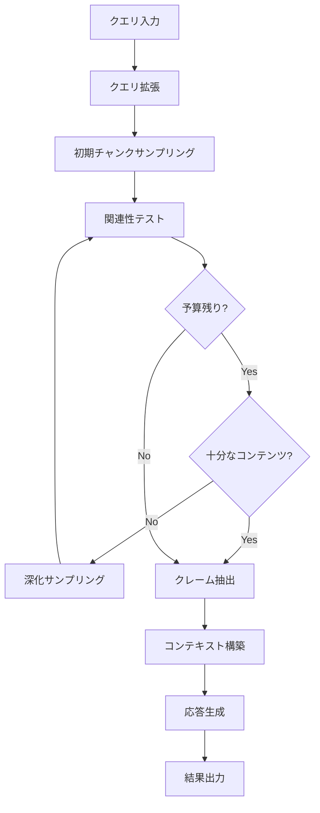

# LazyGraphRAG Search

LazyGraphRAG は、GraphRAG の低コスト版クエリアルゴリズムです。フル GraphRAG の約 **1/100 のコスト**で、同等の品質を実現します。

## 概要

LazyGraphRAG は以下の特徴を持ちます：

- **予算制御型 LLM 呼び出し**: Z100/Z500/Z1500 プリセットで LLM コストを制御
- **反復深化検索**: 関連性の高いコンテンツに焦点を当てた段階的探索
- **クエリ拡張**: 包括的なカバレッジのためのサブクエリ分解
- **クレーム抽出**: 構造化された回答生成のための事実抽出

## クイックスタート

### 基本的な使用方法

```python
import pandas as pd
from graphrag.config.models.lazy_search_config import LazySearchConfig
from graphrag.query.structured_search.lazy_search import (
    LazySearch,
    LazySearchData,
)

# テキストチャンクの準備
text_chunks = pd.DataFrame({
    "id": ["chunk_1", "chunk_2", "chunk_3"],
    "text": [
        "GraphRAG は知識グラフを使用したRAGシステムです。",
        "LLM を使用してエンティティと関係を抽出します。",
        "コミュニティ検出により階層的な要約を生成します。",
    ],
})

# 検索データの作成
data = LazySearchData(text_chunks=text_chunks)

# プリセットから検索インスタンスを作成
search = LazySearch.from_preset(
    preset="z500",
    model=your_chat_model,
    data=data,
)

# 検索実行
result = await search.search("GraphRAG とは何ですか？")
print(result.response)
```

### プリセット設定

| プリセット | 予算 | 用途 |
|-----------|------|------|
| `z100` | 100 | 高速・低コスト。シンプルな質問向け |
| `z500` | 500 | バランス型（デフォルト）。一般的な用途 |
| `z1500` | 1500 | 高品質。複雑な質問向け |

```python
# Z100（低コスト）
config = LazySearchConfig.from_preset("z100")

# Z500（バランス）
config = LazySearchConfig.from_preset("z500")

# Z1500（高品質）
config = LazySearchConfig.from_preset("z1500")
```

## 設定オプション

### LazySearchConfig

```python
from graphrag.config.models.lazy_search_config import LazySearchConfig

config = LazySearchConfig(
    # 関連性テスト予算
    relevance_budget=500,           # LLM 呼び出し回数の上限
    
    # クエリマッチング
    top_k_chunks=100,               # 初期取得チャンク数
    breadth_limit=10,               # コミュニティ探索の幅制限
    
    # 関連性テスト
    relevance_threshold=5.0,        # 関連性スコア閾値（0-10）
    batch_size=10,                  # バッチサイズ
    
    # 反復深化
    max_depth=3,                    # 最大深度
    zero_relevance_threshold=3,     # 深化トリガー（連続ゼロ回数）
    sufficient_relevance_count=50,  # 目標関連文数
    
    # 応答生成
    response_type="multiple paragraphs",
    include_citations=True,
    max_response_tokens=2000,
    temperature=0.0,
)
```

## アーキテクチャ

### コンポーネント構成

```
LazySearch
├── QueryExpander          # クエリ拡張
├── RelevanceTester        # 関連性テスト
├── ClaimExtractor         # クレーム抽出
├── LazyContextBuilder     # コンテキスト構築
└── IterativeDeepener      # 反復深化制御
```

### 処理フロー



## 詳細な使用例

### カスタム設定での検索

```python
from graphrag.config.models.lazy_search_config import LazySearchConfig
from graphrag.query.structured_search.lazy_search import (
    LazySearch,
    LazySearchData,
)

# カスタム設定
config = LazySearchConfig(
    relevance_budget=300,
    relevance_threshold=6.0,
    max_depth=2,
    sufficient_relevance_count=30,
)

# 検索インスタンス作成
search = LazySearch(
    model=your_chat_model,
    config=config,
    data=LazySearchData(text_chunks=chunks_df),
)

result = await search.search("主要なテーマは何ですか？")
```

### ストリーミング応答

```python
async for chunk in search.stream_search("GraphRAG の利点は？"):
    print(chunk, end="", flush=True)
```

### 会話履歴の使用

```python
from graphrag.query.context_builder.conversation_history import (
    ConversationHistory,
    ConversationTurn,
)

history = ConversationHistory()
history.add_turn(ConversationTurn(
    role="user",
    content="GraphRAG について教えてください",
))
history.add_turn(ConversationTurn(
    role="assistant", 
    content="GraphRAG は知識グラフベースの RAG システムです...",
))

result = await search.search(
    "もっと詳しく教えてください",
    conversation_history=history,
)
```

### 検索結果の詳細

```python
result = await search.search("質問")

# 基本情報
print(f"応答: {result.response}")
print(f"完了時間: {result.completion_time:.2f}秒")

# LazySearch 固有のメトリクス
print(f"反復回数: {result.iterations_used}")
print(f"処理チャンク数: {result.chunks_processed}")
print(f"使用予算: {result.budget_used}")
print(f"抽出クレーム数: {result.claims_extracted}")
print(f"関連文数: {result.relevant_sentences}")

# コンテキストデータ
if "claims" in result.context_data:
    print("\n抽出されたクレーム:")
    for _, row in result.context_data["claims"].iterrows():
        print(f"  - {row['statement']} (信頼度: {row['confidence']:.2f})")
```

## コンポーネントの個別使用

### QueryExpander

```python
from graphrag.query.structured_search.lazy_search import QueryExpander

expander = QueryExpander(model)
result = await expander.expand("GraphRAG の利点と欠点は？")

print(f"元のクエリ: {result.original_query}")
print(f"サブクエリ: {result.subqueries}")
print(f"理由: {result.reasoning}")
```

### RelevanceTester

```python
from graphrag.query.structured_search.lazy_search import (
    RelevanceTester,
    LazySearchState,
)

state = LazySearchState(budget_total=100)
tester = RelevanceTester(model, relevance_threshold=5.0)

result = await tester.test_sentences(
    sentences=["文1", "文2", "文3"],
    chunk_id="chunk_1",
    community_id="com_1",
    queries=["質問"],
    state=state,
)

for sentence in result.relevant_sentences:
    print(f"スコア {sentence.score}: {sentence.text}")
```

### ClaimExtractor

```python
from graphrag.query.structured_search.lazy_search import ClaimExtractor

extractor = ClaimExtractor(model)
claims = await extractor.extract_claims(
    relevant_sentences=relevant_sentences,
    query="質問",
)

for claim in claims:
    print(f"[{claim.confidence:.2f}] {claim.statement}")
```

## Global Search / Local Search との比較

| 特徴 | LazySearch | GlobalSearch | LocalSearch |
|------|------------|--------------|-------------|
| コスト | 低（〜1/100） | 高 | 中 |
| 速度 | 高速 | 低速 | 中速 |
| 品質 | 良好 | 最高 | 高 |
| 用途 | 一般クエリ | 広範な要約 | 特定エンティティ |
| 必要データ | テキストチャンク | コミュニティレポート | エンティティ・関係 |

## ベストプラクティス

### プリセットの選択

- **Z100**: FAQ、シンプルな事実質問、リアルタイムアプリケーション
- **Z500**: 一般的な質問、分析タスク、バランスが必要な場合
- **Z1500**: 複雑な質問、詳細な分析、品質が最優先の場合

### パフォーマンス最適化

1. **適切なプリセットを選択**: 用途に応じて Z100/Z500/Z1500 を選択
2. **チャンクサイズの調整**: 大きすぎるチャンクは関連性テストの精度を下げる
3. **閾値の調整**: `relevance_threshold` を調整してノイズを削減

### トラブルシューティング

**Q: 応答が浅い/不完全**
- `relevance_budget` を増やす（Z500 → Z1500）
- `sufficient_relevance_count` を増やす

**Q: 応答が遅い**
- `relevance_budget` を減らす（Z500 → Z100）
- `max_depth` を減らす

**Q: 関連性の低い結果が混ざる**
- `relevance_threshold` を上げる（5.0 → 7.0）

## API リファレンス

詳細な API ドキュメントは以下を参照してください：

- [`LazySearch`](../api/query/lazy_search.md#lazysearch)
- [`LazySearchConfig`](../api/config/lazy_search_config.md)
- [`LazySearchState`](../api/query/lazy_search.md#lazysearchstate)
