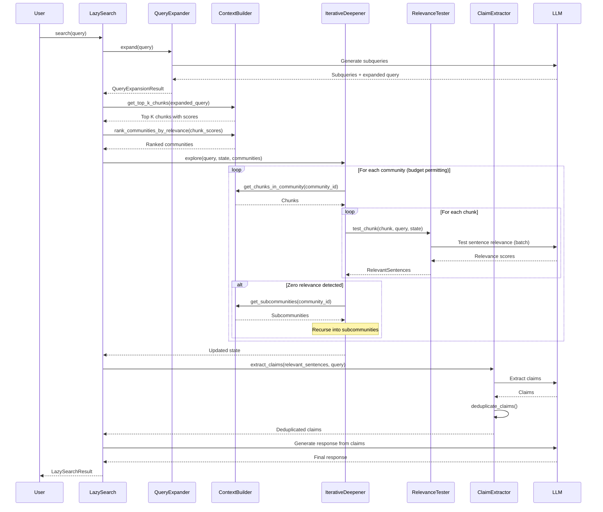

# LazyGraphRAG クエリアルゴリズム機能仕様書

**Document ID**: SPEC-LAZY-001
**Version**: 1.0
**Status**: Draft
**Created**: 2024-12-22
**Requirements Reference**: REQ-LAZY-001

---

## 1. 概要

### 1.1 目的

本仕様書は、LazyGraphRAGクエリアルゴリズムの技術的な実装仕様を定義します。

### 1.2 アーキテクチャ概要

```
┌─────────────────────────────────────────────────────────────────┐
│                    LazyGraphRAG Search                          │
├─────────────────────────────────────────────────────────────────┤
│  ┌──────────────┐  ┌──────────────┐  ┌──────────────┐          │
│  │   Query      │  │   Query      │  │  Relevance   │          │
│  │  Refinement  │──│  Matching    │──│   Testing    │          │
│  └──────────────┘  └──────────────┘  └──────────────┘          │
│         │                 │                 │                   │
│         ▼                 ▼                 ▼                   │
│  ┌──────────────┐  ┌──────────────┐  ┌──────────────┐          │
│  │   Iterative  │  │    Claim     │  │   Response   │          │
│  │  Deepening   │──│  Extraction  │──│  Generation  │          │
│  └──────────────┘  └──────────────┘  └──────────────┘          │
├─────────────────────────────────────────────────────────────────┤
│                 LazySearchContextBuilder                        │
├─────────────────────────────────────────────────────────────────┤
│  NounGraph │ Communities │ TextChunks │ Embeddings              │
└─────────────────────────────────────────────────────────────────┘
```

---

## 2. コンポーネント仕様

### 2.1 LazySearch クラス

**ファイル**: `graphrag/query/structured_search/lazy_search/search.py`

```python
@dataclass(kw_only=True)
class LazySearchResult(SearchResult):
    """A LazyGraphRAG search result."""
    
    expanded_query: str
    subqueries: list[str]
    relevant_sentences: list[dict[str, Any]]
    claims: list[dict[str, Any]]
    communities_visited: list[str]
    budget_used: int
    budget_total: int


class LazySearch(BaseSearch[LazyContextBuilder]):
    """Search orchestration for LazyGraphRAG search mode."""
    
    def __init__(
        self,
        model: ChatModel,
        context_builder: LazyContextBuilder,
        tokenizer: Tokenizer | None = None,
        # Query Refinement Parameters
        max_subqueries: int = 5,
        # Query Matching Parameters  
        top_k_chunks: int = 100,
        breadth_limit: int = 10,
        # Relevance Testing Parameters
        relevance_budget: int = 500,  # Z100, Z500, Z1500
        relevance_threshold: float = 5.0,
        batch_size: int = 10,
        # Iterative Deepening Parameters
        max_depth: int = 3,
        zero_relevance_threshold: int = 3,
        sufficient_relevance_count: int = 50,
        # Response Generation Parameters
        response_type: str = "multiple paragraphs",
        include_citations: bool = True,
        # System Prompts (customizable)
        query_expansion_prompt: str | None = None,
        relevance_test_prompt: str | None = None,
        claim_extraction_prompt: str | None = None,
        response_generation_prompt: str | None = None,
        # Callbacks
        callbacks: list[QueryCallbacks] | None = None,
        # LLM Parameters
        llm_params: dict[str, Any] | None = None,
    ):
        ...
```

### 2.2 LazySearchState クラス

**ファイル**: `graphrag/query/structured_search/lazy_search/state.py`

```python
@dataclass
class LazySearchState:
    """State management for LazyGraphRAG search."""
    
    # Query State
    original_query: str = ""
    expanded_query: str = ""
    subqueries: list[str] = field(default_factory=list)
    
    # Exploration State
    visited_communities: set[str] = field(default_factory=set)
    current_depth: int = 0
    consecutive_zero_relevance: int = 0
    
    # Collection State
    relevant_sentences: list[RelevantSentence] = field(default_factory=list)
    claims: list[Claim] = field(default_factory=list)
    
    # Budget State
    budget_total: int = 500
    budget_used: int = 0
    
    @property
    def budget_remaining(self) -> int:
        return self.budget_total - self.budget_used
    
    @property
    def should_deepen(self) -> bool:
        return self.consecutive_zero_relevance >= 3
    
    @property
    def has_sufficient_content(self) -> bool:
        return len(self.relevant_sentences) >= 50


@dataclass
class RelevantSentence:
    """A sentence deemed relevant to the query."""
    
    text: str
    score: float
    chunk_id: str
    community_id: str
    position_in_chunk: int


@dataclass  
class Claim:
    """An extracted claim from relevant content."""
    
    statement: str
    source_chunk_ids: list[str]
    confidence: float
    supporting_sentences: list[str]
```

### 2.3 LazyContextBuilder クラス

**ファイル**: `graphrag/query/structured_search/lazy_search/context.py`

```python
class LazyContextBuilder(BasicContextBuilder):
    """Context builder for LazyGraphRAG search."""
    
    def __init__(
        self,
        noun_graph_nodes: pd.DataFrame,
        noun_graph_edges: pd.DataFrame,
        communities: pd.DataFrame,
        community_hierarchy: pd.DataFrame,
        text_chunks: pd.DataFrame,
        chunk_embeddings: np.ndarray,
        embedding_model: Any,
    ):
        ...
    
    async def get_top_k_chunks(
        self,
        query: str,
        k: int = 100,
    ) -> list[dict[str, Any]]:
        """Get top K chunks by embedding similarity."""
        ...
    
    def get_community_for_chunk(
        self,
        chunk_id: str,
    ) -> str | None:
        """Get the community ID for a given chunk."""
        ...
    
    def get_subcommunities(
        self,
        community_id: str,
    ) -> list[str]:
        """Get subcommunities for a given community."""
        ...
    
    def get_chunks_in_community(
        self,
        community_id: str,
    ) -> list[dict[str, Any]]:
        """Get all chunks belonging to a community."""
        ...
    
    def rank_communities_by_relevance(
        self,
        chunk_scores: dict[str, float],
    ) -> list[tuple[str, float]]:
        """Rank communities by aggregated chunk scores."""
        ...
```

### 2.4 QueryExpander クラス

**ファイル**: `graphrag/query/structured_search/lazy_search/query_expander.py`

```python
class QueryExpander:
    """Expands user queries into subqueries."""
    
    def __init__(
        self,
        model: ChatModel,
        max_subqueries: int = 5,
        system_prompt: str | None = None,
    ):
        ...
    
    async def expand(
        self,
        query: str,
    ) -> QueryExpansionResult:
        """Expand a query into subqueries and combined expanded query."""
        ...


@dataclass
class QueryExpansionResult:
    """Result of query expansion."""
    
    original_query: str
    subqueries: list[str]
    expanded_query: str
    reasoning: str
```

### 2.5 RelevanceTester クラス

**ファイル**: `graphrag/query/structured_search/lazy_search/relevance_tester.py`

```python
class RelevanceTester:
    """Tests sentence-level relevance using LLM."""
    
    def __init__(
        self,
        model: ChatModel,
        threshold: float = 5.0,
        batch_size: int = 10,
        system_prompt: str | None = None,
    ):
        ...
    
    async def test_chunk(
        self,
        chunk: dict[str, Any],
        query: str,
        state: LazySearchState,
    ) -> list[RelevantSentence]:
        """Test all sentences in a chunk for relevance."""
        ...
    
    async def test_sentences_batch(
        self,
        sentences: list[str],
        query: str,
        chunk_id: str,
        community_id: str,
    ) -> list[RelevantSentence]:
        """Test a batch of sentences for relevance."""
        ...


@dataclass
class RelevanceTestResult:
    """Result of relevance testing for a sentence."""
    
    sentence: str
    score: float
    is_relevant: bool
    reasoning: str
```

### 2.6 ClaimExtractor クラス

**ファイル**: `graphrag/query/structured_search/lazy_search/claim_extractor.py`

```python
class ClaimExtractor:
    """Extracts claims from relevant content."""
    
    def __init__(
        self,
        model: ChatModel,
        system_prompt: str | None = None,
        deduplication_threshold: float = 0.85,
    ):
        ...
    
    async def extract_claims(
        self,
        relevant_sentences: list[RelevantSentence],
        query: str,
    ) -> list[Claim]:
        """Extract claims from relevant sentences."""
        ...
    
    def deduplicate_claims(
        self,
        claims: list[Claim],
    ) -> list[Claim]:
        """Remove semantically duplicate claims."""
        ...
    
    def build_concept_subgraph(
        self,
        relevant_sentences: list[RelevantSentence],
        noun_graph_nodes: pd.DataFrame,
        noun_graph_edges: pd.DataFrame,
    ) -> nx.Graph:
        """Build concept subgraph from relevant sentences."""
        ...
```

### 2.7 IterativeDeepener クラス

**ファイル**: `graphrag/query/structured_search/lazy_search/iterative_deepener.py`

```python
class IterativeDeepener:
    """Manages iterative deepening search strategy."""
    
    def __init__(
        self,
        context_builder: LazyContextBuilder,
        relevance_tester: RelevanceTester,
        max_depth: int = 3,
        zero_relevance_threshold: int = 3,
        sufficient_relevance_count: int = 50,
    ):
        ...
    
    async def explore(
        self,
        query: str,
        state: LazySearchState,
        initial_communities: list[tuple[str, float]],
    ) -> LazySearchState:
        """Explore communities with iterative deepening."""
        ...
    
    async def _explore_community(
        self,
        community_id: str,
        query: str,
        state: LazySearchState,
    ) -> int:
        """Explore a single community. Returns relevance count."""
        ...
    
    def _should_continue(
        self,
        state: LazySearchState,
    ) -> bool:
        """Check if exploration should continue."""
        ...
```

---

## 3. 処理フロー

### 3.1 検索メインフロー



### 3.2 関連性テストバッチ処理

```python
async def test_chunk(
    self,
    chunk: dict[str, Any],
    query: str,
    state: LazySearchState,
) -> list[RelevantSentence]:
    """Test all sentences in a chunk for relevance."""
    
    # 1. Split chunk into sentences
    sentences = self._split_into_sentences(chunk["text"])
    
    # 2. Check budget
    sentences_to_test = sentences[:state.budget_remaining]
    if not sentences_to_test:
        return []
    
    # 3. Batch processing
    relevant_sentences = []
    for i in range(0, len(sentences_to_test), self.batch_size):
        batch = sentences_to_test[i:i + self.batch_size]
        
        # 4. Test batch
        results = await self.test_sentences_batch(
            sentences=batch,
            query=query,
            chunk_id=chunk["id"],
            community_id=chunk["community_id"],
        )
        
        # 5. Update state
        state.budget_used += len(batch)
        
        # 6. Filter relevant
        relevant_sentences.extend([
            r for r in results if r.score >= self.threshold
        ])
        
        # 7. Check budget
        if state.budget_remaining <= 0:
            break
    
    return relevant_sentences
```

---

## 4. プロンプト仕様

### 4.1 クエリ展開プロンプト

```python
QUERY_EXPANSION_SYSTEM_PROMPT = """
You are a query expansion assistant. Given a user query, identify implicit subqueries
that would help comprehensively answer the question.

Instructions:
1. Analyze the user's query for implicit information needs
2. Generate up to {max_subqueries} subqueries that cover different aspects
3. Combine all subqueries into a single expanded query

Output Format (JSON):
{{
    "subqueries": ["subquery1", "subquery2", ...],
    "expanded_query": "comprehensive query combining all aspects",
    "reasoning": "explanation of expansion logic"
}}
"""
```

### 4.2 関連性テストプロンプト

```python
RELEVANCE_TEST_SYSTEM_PROMPT = """
You are a relevance assessment assistant. Evaluate each sentence's relevance
to the given query on a scale of 0-10.

Query: {query}

Instructions:
1. Read each sentence carefully
2. Score relevance from 0 (completely irrelevant) to 10 (highly relevant)
3. Consider both direct and indirect relevance
4. A score of 5 or above indicates relevance

Output Format (JSON array):
[
    {{"sentence_index": 0, "score": 7.5, "reasoning": "..."}},
    {{"sentence_index": 1, "score": 2.0, "reasoning": "..."}},
    ...
]

Sentences to evaluate:
{sentences}
"""
```

### 4.3 主張抽出プロンプト

```python
CLAIM_EXTRACTION_SYSTEM_PROMPT = """
You are a claim extraction assistant. Extract factual claims from the provided
relevant content that help answer the query.

Query: {query}

Instructions:
1. Identify specific, verifiable claims
2. Each claim should be self-contained
3. Preserve source information for citations
4. Rank claims by relevance to the query

Output Format (JSON):
{{
    "claims": [
        {{
            "statement": "factual claim text",
            "confidence": 0.95,
            "source_indices": [0, 2, 5],
            "reasoning": "why this claim is relevant"
        }},
        ...
    ]
}}

Relevant Content:
{content}
"""
```

### 4.4 応答生成プロンプト

```python
RESPONSE_GENERATION_SYSTEM_PROMPT = """
You are a helpful assistant. Generate a comprehensive response to the query
using the provided claims as your knowledge base.

Query: {query}

Instructions:
1. Synthesize claims into a coherent response
2. Address all aspects of the query
3. Include citations using [n] format
4. Be factual and avoid speculation
5. Response type: {response_type}

Claims:
{claims}
"""
```

---

## 5. 設定仕様

### 5.1 LazySearchConfig

**ファイル**: `graphrag/config/models/lazy_search_config.py`

```python
@dataclass
class LazySearchConfig:
    """Configuration for LazyGraphRAG search."""
    
    # Preset configurations
    PRESET_Z100 = "z100"
    PRESET_Z500 = "z500"  
    PRESET_Z1500 = "z1500"
    
    # Query Refinement
    max_subqueries: int = 5
    query_expansion_enabled: bool = True
    
    # Query Matching
    top_k_chunks: int = 100
    breadth_limit: int = 10
    
    # Relevance Testing
    relevance_budget: int = 500
    relevance_threshold: float = 5.0
    batch_size: int = 10
    
    # Iterative Deepening
    max_depth: int = 3
    zero_relevance_threshold: int = 3
    sufficient_relevance_count: int = 50
    
    # Response Generation
    response_type: str = "multiple paragraphs"
    include_citations: bool = True
    max_response_tokens: int = 2000
    
    # LLM Parameters
    temperature: float = 0.0
    
    @classmethod
    def from_preset(cls, preset: str) -> "LazySearchConfig":
        """Create config from preset name."""
        presets = {
            cls.PRESET_Z100: {"relevance_budget": 100, "sufficient_relevance_count": 20},
            cls.PRESET_Z500: {"relevance_budget": 500, "sufficient_relevance_count": 50},
            cls.PRESET_Z1500: {"relevance_budget": 1500, "sufficient_relevance_count": 100},
        }
        if preset not in presets:
            raise ValueError(f"Unknown preset: {preset}")
        return cls(**presets[preset])
```

---

## 6. API仕様

### 6.1 search() メソッド

```python
async def search(
    self,
    query: str,
    conversation_history: ConversationHistory | None = None,
    **kwargs: Any,
) -> LazySearchResult:
    """
    Perform LazyGraphRAG search.
    
    Args:
        query: The user's query string.
        conversation_history: Optional conversation context.
        **kwargs: Additional parameters.
    
    Returns:
        LazySearchResult containing:
            - response: Generated answer
            - context_data: DataFrames of context used
            - context_text: Formatted context string
            - completion_time: Total search time
            - llm_calls: Number of LLM calls made
            - prompt_tokens: Total prompt tokens used
            - output_tokens: Total output tokens generated
            - expanded_query: The expanded query used
            - subqueries: List of identified subqueries
            - relevant_sentences: Sentences found relevant
            - claims: Extracted claims
            - communities_visited: Communities explored
            - budget_used: Relevance tests performed
            - budget_total: Total budget allocated
    """
```

### 6.2 stream_search() メソッド

```python
async def stream_search(
    self,
    query: str,
    conversation_history: ConversationHistory | None = None,
) -> AsyncGenerator[str, None]:
    """
    Stream LazyGraphRAG search response.
    
    Yields tokens as they are generated.
    """
```

---

## 7. ディレクトリ構造

```
graphrag/query/structured_search/lazy_search/
├── __init__.py
├── search.py              # LazySearch class
├── state.py               # LazySearchState, RelevantSentence, Claim
├── context.py             # LazyContextBuilder
├── query_expander.py      # QueryExpander
├── relevance_tester.py    # RelevanceTester  
├── claim_extractor.py     # ClaimExtractor
└── iterative_deepener.py  # IterativeDeepener

graphrag/config/models/
├── lazy_search_config.py  # LazySearchConfig

graphrag/prompts/query/
├── lazy_query_expansion_prompt.py
├── lazy_relevance_test_prompt.py
├── lazy_claim_extraction_prompt.py
└── lazy_response_generation_prompt.py
```

---

## 8. テスト仕様

### 8.1 ユニットテスト

| テストID | 対象 | 内容 |
|----------|------|------|
| UT-LAZY-001 | QueryExpander | サブクエリ生成の正確性 |
| UT-LAZY-002 | RelevanceTester | バッチ処理の正確性 |
| UT-LAZY-003 | RelevanceTester | 予算制限の遵守 |
| UT-LAZY-004 | IterativeDeepener | 再帰探索の正確性 |
| UT-LAZY-005 | ClaimExtractor | 重複除去の正確性 |
| UT-LAZY-006 | LazySearchState | 状態管理の一貫性 |

### 8.2 統合テスト

| テストID | 対象 | 内容 |
|----------|------|------|
| IT-LAZY-001 | LazySearch | E2E検索フロー |
| IT-LAZY-002 | LazySearch | プリセット設定（Z100/Z500/Z1500） |
| IT-LAZY-003 | LazySearch | ストリーミング応答 |
| IT-LAZY-004 | LazySearch | コールバック呼び出し |

---

## 9. 変更履歴

| Version | Date | Author | Changes |
|---------|------|--------|---------|
| 1.0 | 2024-12-22 | GitHub Copilot | 初版作成 |

---

**Powered by MUSUBI** - Constitutional governance for specification-driven development.
